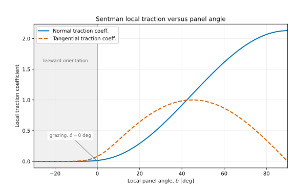

# Free Molecular Flow (FMF)

FMF evaluates free-molecular-flow panel loads with the Sentman model. Unlike a
pressure-only model, its local nondimensional traction retains both normal and
tangential/freestream contributions. The shared engine then applies panel area,
reference-area normalization, force/moment integration, and component totals.

## Flow inputs

Exactly one mode must be supplied:

- **Mode A:** positive molecular speed ratio
  `S = V_inf / sqrt(2 R Ti)` and positive free-stream incident translational
  (static) temperature `Ti_K`. `Ti_K` is not total or stagnation temperature;
  the supplied `S` and `Ti_K` must describe the same free-stream state.
- **Mode B:** positive `Mach` and `Altitude_km` in the bundled US1976 table's
  inclusive `0–1000 km` geometric-altitude range. The solver linearly
  interpolates static translational temperature, speed of sound, and mean
  molecular speed. It sets `V_inf = Mach * c`, converts mean molecular speed to
  most-probable speed with `V_mp = sqrt(pi) / 2 * V_mean`, and resolves
  `S = V_inf / V_mp` and `Ti_K` without a total-temperature conversion.

The bundled table's scientific, software-right, regeneration, rounding, and
full-grid equivalence evidence is recorded in
[US1976 Sentman atmosphere data provenance](../reference/us1976-data-provenance.md).

Both modes require positive wall temperature `Tw_K`. The reflected Sentman term
uses `sqrt(Tw_K / Ti_K)`; because there is no separate reflected-gas temperature
or accommodation input, FMF uses the wall temperature as the diffusely
reflected molecular temperature (`T_r = T_w`). Supplying both modes, only half a
pair, or neither mode is invalid.

## Sentman local-load equation

For each panel, the Sentman model computes a local nondimensional traction
vector. The model returns this vector without panel-area or reference-area
scaling; the shared engine applies those factors and performs force, moment, and
component integration. General frame transformations and moment conventions are
described in [Numerical conventions](../reference/numerical-conventions.md).

### Geometry and symbols

- $\hat{\boldsymbol V}$ is the unit flow direction in the STL frame.
- $\boldsymbol n_{\mathrm{out}}$ is the STL outward unit normal.
- $\boldsymbol n_{\mathrm{in}}=-\boldsymbol n_{\mathrm{out}}$ is the inward
  unit normal used in Sentman's original report.
- $\gamma=\boldsymbol n_{\mathrm{in}}\mathbin{\boldsymbol\cdot}
  \hat{\boldsymbol V}$ is the direction cosine between the flow and inward
  normal. Here, $\gamma$ is not the specific-heat ratio used by Hypersonic
  methods.
- $S$ is the molecular speed ratio, $T_i$ is the incident translational
  temperature, and $T_w$ is the wall temperature. The input columns are `S`,
  `Ti_K`, and `Tw_K`.

### Auxiliary functions and local traction

Define

```math
h = \gamma S,
\qquad
\Phi = 1 + \mathrm{erf}(h),
\qquad
E = e^{-h^2}.
```

The implemented coefficients are

```math
c_{\parallel}
=
\gamma\Phi
+
\frac{E}{S\sqrt{\pi}},
```

```math
c_{n,i}
=
\frac{\Phi}{2S^2},
```

and

```math
c_{n,r}
=
\frac{1}{2}
\sqrt{\frac{T_w}{T_i}}
\left[
\frac{\gamma\sqrt{\pi}}{S}\Phi
+
\frac{E}{S^2}
\right].
```

The local traction coefficient is therefore

```math
\boldsymbol{\tau}
=
c_{\parallel}\hat{\boldsymbol V}
+
\left(c_{n,i}+c_{n,r}\right)\boldsymbol n_{\mathrm{in}}.
```

In this local equation, $S$ enters the projected speed $h$ and the explicit
$1/S$ and $1/S^2$ terms. The incident temperature and wall temperature enter
the reflected coefficient through $\sqrt{T_w/T_i}$; $T_i$ also belongs to the
physical free-stream state used to define or resolve $S$. Consequently, `S`,
`Ti_K`, and `Tw_K` describe distinct parts of the implemented load rather than
three interchangeable temperature or velocity corrections.

The three terms have distinct roles. The
$c_{\parallel}\hat{\boldsymbol V}$ term is the incident-molecule load in the
flow direction and retains the component tangent to the panel.
$c_{n,i}\boldsymbol n_{\mathrm{in}}$ is the normal contribution from the
random thermal motion of incident molecules, while
$c_{n,r}\boldsymbol n_{\mathrm{in}}$ is the normal contribution from diffusely
reflected molecules. Under complete diffuse reflection, reflected tangential
momentum cancels statistically, so the reflected term appears only in the
normal direction. The error-function and exponential terms retain random
thermal motion, so this is not a simple windward-only pressure law.

For panel $j$, the common integrator forms

```math
\Delta\boldsymbol C_j
=
\boldsymbol{\tau}_j
\frac{A_j}{A_{\mathrm{ref}}}.
```

This is algebraically the same as the original report's $dC/dA$ form. The
current model returns the local traction numerator, and the common integrator
applies $A_j/A_{\mathrm{ref}}$ exactly once before summing whole-vehicle forces
and moments.

### Representative angular response

For this illustrative angular response, the flow direction is fixed at
$\hat{\boldsymbol V}=[1,0,0]$ and the panel normal varies as
$\boldsymbol n_{\mathrm{in}}=[\sin\delta,\cos\delta,0]$. Thus
$\mu=\boldsymbol n_{\mathrm{in}}\mathbin{\boldsymbol\cdot}
\hat{\boldsymbol V}=\sin\delta$, where $\delta=-90^\circ$ faces directly away
from the flow, $\delta=0^\circ$ is grazing incidence, and $\delta=+90^\circ$
faces directly into the flow. The output angle is related by
$\delta=\mathtt{theta\_deg}-90^\circ$. The plotted Mode A case uses
$T_i=1000\ \mathrm{K}$ and $T_w=180.625\ \mathrm{K}$ to provide the stated
representative temperature ratio.



**Figure.** Representative local response at $S=7$ and
$\sqrt{T_w/T_i}=0.425$, using complete diffuse reflection, complete thermal
accommodation with $T_r=T_w$, and no ray shielding. The vertical line at
$\delta=0^\circ$ marks grazing incidence; finite load there results from random
thermal motion. These curves show the local response of one isolated,
unshielded panel before multiplication by $A_j/A_{\mathrm{ref}}$. They are not
whole-vehicle aerodynamic polars.

The plotted normal component is the `normal_traction_coeff` scalar,

```math
\mathtt{normal\_traction\_coeff}
=
-\boldsymbol\tau\mathbin{\boldsymbol\cdot}\boldsymbol n_{\mathrm{out}}.
```

The tangential positive direction is the in-plane projection of the uniform
flow direction,

```math
\hat{\boldsymbol t}
=
\frac{
\hat{\boldsymbol V}
-(\hat{\boldsymbol V}\mathbin{\boldsymbol\cdot}\boldsymbol n_{\mathrm{out}})
\boldsymbol n_{\mathrm{out}}
}{
\left\lVert
\hat{\boldsymbol V}
-(\hat{\boldsymbol V}\mathbin{\boldsymbol\cdot}\boldsymbol n_{\mathrm{out}})
\boldsymbol n_{\mathrm{out}}
\right\rVert
},
```

and `tangential_traction_coeff` is
$\boldsymbol\tau\mathbin{\boldsymbol\cdot}\hat{\boldsymbol t}$. At normal
incidence, where the in-plane direction is not unique, it is exactly zero. At
grazing incidence the load is
not exactly zero, Sentman retains tangential traction, and a negative local
angle does not make the response immediately vanish because random molecular
thermal motion remains. Geometrically occluded faces are handled separately:
ray shielding sets their complete traction to exact zero.

### Assumptions and implementation scope

Sentman's Eq. (21) applies within kinetic theory, free-molecular flow, and
complete diffuse-reflection assumptions. Its general form uses reflected
molecular temperature $T_r$. FMF has no independent $T_r$ input or thermal
accommodation coefficient; the current implementation assumes complete thermal
accommodation and substitutes $T_r=T_w$, which produces the
$\sqrt{T_w/T_i}$ factor above.

This equation does not model specular reflection, mixed reflection, an arbitrary
thermal accommodation coefficient, or multiple reflections between surfaces.
Ray shielding is a separate geometric approximation that sets an occluded
panel's load to zero; see
[Shielding and parallel execution](../user-guide/shielding-and-parallel.md).

## Outputs and scope

FMF VTP data includes `normal_traction_coeff`,
`tangential_traction_coeff`, and `theta_deg`. Summary CSV includes resolved
`mode`, `out_S`, and `out_Ti_K`; `Tw_K` remains an input column. Both displayed
traction scalars are derived from the model's `traction_coeff_stl`; they do not
participate in whole-vehicle integration. See the
[Summary CSV reference](../results/summary-csv.md#fmf-resolved-state-fields)
and [VTP reference](../results/vtp.md#fmf) for complete field contracts.

Use this model only when the free-molecular/Sentman assumptions are appropriate
for the intended regime and surface interaction. Mode B is tied to the bundled,
pinned atmosphere table and does not accept extrapolation beyond its altitude
range. It does not become a continuum-flow model merely because Mach is used to
derive speed ratio.

See the [FMF input reference](../reference/fmf-input.md) and
[numerical conventions](../reference/numerical-conventions.md).

## Reference

Lee H. Sentman, *Free Molecule Flow Theory and Its Application to the
Determination of Aerodynamic Forces*, LMSC-448514, 1961, Section II-B,
especially Eq. (21).
