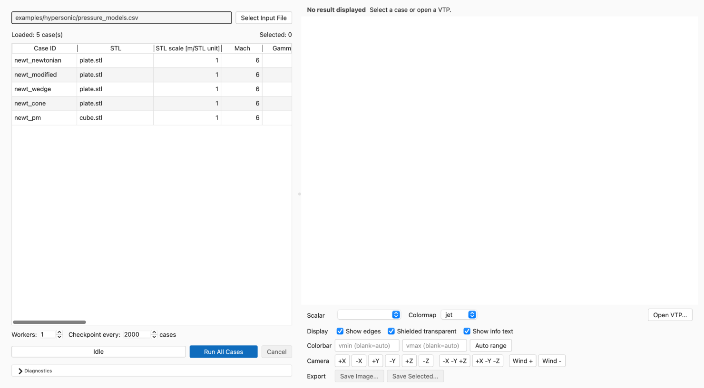
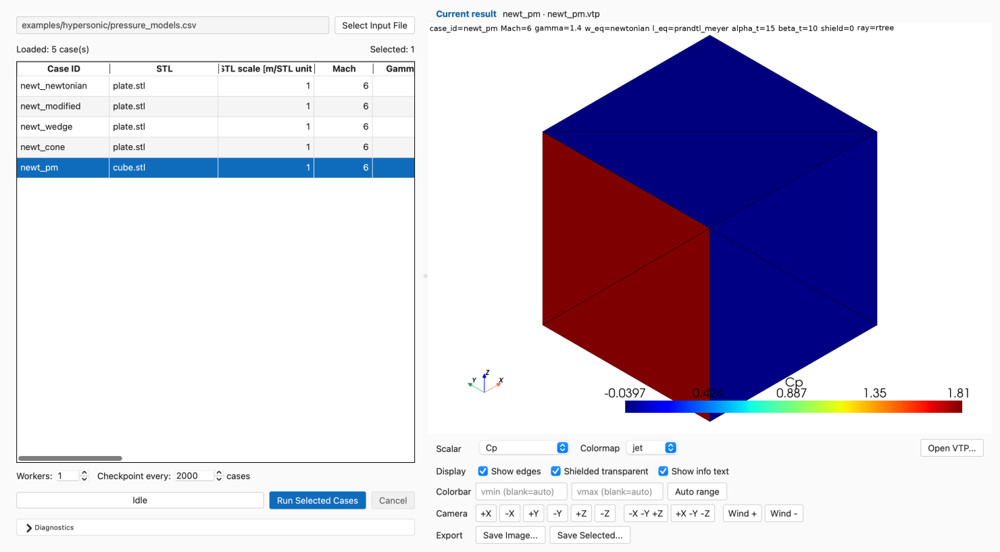

# GUI guide

Launch the GUI with a flow-domain selector:

```bash
panelsolver-gui fmf
panelsolver-gui hypersonic
```

These open `Panel Solver — FMF` and `Panel Solver — Hypersonic`. FMF
uses the Sentman physical model; Hypersonic provides Newtonian-family methods.

## Offline help

Both launchers provide the same **Help** menu:

- **Documentation** opens the bundled offline site home;
- **About** shows Panel Solver, the installed `panelsolver` distribution
  version, the active FMF or Hypersonic domain, and the Apache-2.0 license.

Pages are opened as local `file://` URLs through the desktop browser. The wheel
contains every page and asset in the site, so Help does not use the network or
require MkDocs at runtime. If the installed documentation is missing or the
browser rejects the local URL, the GUI reports an error. An editable checkout
may build a temporary site with the docs dependency group installed; those
temporary site files remain available for the lifetime of the window.



*A loaded Hypersonic multi-case table with run controls visible and the Viewer
ready for result inspection.*

## Run cases

1. Choose **Select Input File** or **File > Open Input File...** and open a CSV,
   XLSX, or XLSM case table. Immediately after a new GUI launch, the dialog starts
   in the process working directory. After an input table loads through this
   dialog, later dialogs in the same GUI session start in that file's parent
   directory. This directory is not carried over after the GUI exits and
   restarts. If it is deleted during the session, the dialog falls back to the
   process working directory.
2. Select one or more table rows to run only those cases. With no selected rows,
   **Run All Cases** runs every loaded case.
3. Set **Workers**. Use `1` for the simplest deterministic run.
4. Set **Checkpoint every** in cases. The default is `2000`; use `0` to
   disable intermediate Summary CSV snapshots. See
   [Batch execution and recovery](batch-execution-and-recovery.md) for snapshot
   and recovery behavior.
5. Choose **Run All Cases** or **Run Selected Cases**, as shown for the selected
   rows, and select the Summary CSV destination. The dialog defaults to
   `<input_dir>/outputs/<input_stem>_result.csv`.
6. Follow the always-visible progress state. Select **Diagnostics** when detailed
   operational messages are useful.

The Diagnostics log is collapsed by default so cases, run controls, progress,
the Viewer, and its status row retain priority. Collapsing Diagnostics does
not discard its history: messages continue to accumulate and are available when
the section is expanded again.

The case table uses user-facing headers with source units while retaining the
case-file column names internally. Comparable numeric values are right-aligned;
identifiers and text remain left-aligned, and 0/1 flags are centered. This
presentation layer does not round values, normalize scientific notation, or
convert units.

A run whose calculations finish with one or more VTP or Summary CSV write
failures ends as **Completed with output errors**, not **Failed**, and shows one
bounded summary at the end; details remain in the log. **Failed** is
reserved for case-computation failures such as geometry loading or model
execution errors. Continuation and recovery behavior is in
[Batch execution and recovery](batch-execution-and-recovery.md).
After a VTP failure, an older file at that case's planned path is not auto-loaded
as the newly calculated result. It remains available for explicit **Open VTP...**
inspection.

Input validation issues are shown with spreadsheet row, case ID, field, and
message. The GUI uses the same reader, solver, checkpoint behavior, and CSV/VTP
writers as the CLI.

## Start from an example

Choose **File > New from Example** to see only the examples for the active FMF
or Hypersonic domain. Select a workspace directory; the GUI copies the chosen
case table and its required geometry there with their relative layout intact,
then opens the copied table. Packaged examples are never run in place, and
opening one does not replace the session's remembered directory for normal input
files.

## View and export

When a case saves VTP, the first selected case's result is loaded automatically.
A selected row also loads an existing `<out_dir>/<case_id>.vtp` when the file's
`case_id` and `case_signature` match the selected case ID and the signature
calculated from that case. Missing VTP files and files with a mismatched case ID
or signature are not rendered automatically. The compact status row above the
Viewer explains what result is displayed or why no matching VTP is available;
the [VTP reference](../results/vtp.md) lists the signature and case-level field
data.



*The `newt_pm` case with its matching VTP loaded automatically and the cube
geometry displayed using `Cp`.*

VTP files can be opened from **File > Open VTP...** or the Viewer
**Open VTP...** button. This manual operation can display a VTP that does not
match any row in the loaded case table. The status identifies the file as
**Manual VTP** and explicitly says whether it matched a loaded case. A manually
opened, unmatched VTP is not the result for the selected case,
even though its geometry remains visible. The viewer can switch among available
cell scalars, adjust the camera and coloring, open another VTP, and save images.
Scalar controls and color bars use human-readable labels such as `Cp`,
`Normal traction coeff.`, and `Tangential traction coeff.` while VTP retains
explicit machine-oriented field names.

| VTP/internal field | GUI label |
|---|---|
| `cp` | Cp |
| `normal_traction_coeff` | Normal traction coeff. |
| `tangential_traction_coeff` | Tangential traction coeff. |
| `shielded` | Shielded |
| `theta_deg` | Theta [deg] |
| `area_m2` | Area [m^2] |
| `center_x_stl_m` | Center X [m] |
| `center_y_stl_m` | Center Y [m] |
| `center_z_stl_m` | Center Z [m] |
| `stl_index` | STL index |

For a VTP that matches a loaded case, **Save Image...** starts at
`<resolved_out_dir>/images/<case_id>__<scalar_name>.png`. The scalar portion is
the machine-oriented VTP field name from the first column above, not its GUI
label. For example, the default may be
`outputs/images/case_001__normal_traction_coeff.png`.
Characters that are unsafe in portable filenames (`/`, `\`, `:`, `*`, `?`,
`"`, `<`, `>`, `|`, and control characters) are replaced with `_` in both the
case or VTP identifier and scalar portions. Leading and trailing whitespace and
trailing dots are removed; an empty result uses a safe fallback name.

For a VTP opened with **Open VTP...** that does not match both the case ID and
signature of any loaded case, the default is
`<vtp_parent>/images/<vtp_stem>__<scalar_name>.png`. A stale or
signature-mismatched VTP can still be inspected and exported manually.

**Save Selected...** starts at `<resolved_out_dir>/images` when every selected
case resolves to the same output directory. If selected cases use different
resolved output directories, it starts at `<input_dir>/outputs/images`,
independent of row order. Batch filenames use the same
`<case_id>__<scalar_name>.png` form. Existing files are never overwritten by a
batch export: Panel Solver adds `_2`, `_3`, and so on before `.png`, including
when names would collide within the same batch.

If another image directory is selected, it is reused as the starting directory
for later image saves from VTPs matched to loaded cases while the same input
file remains loaded. The GUI remembers this choice only for the session and
resets it after a different input file loads. If the remembered directory is
unavailable, the default directory is used again. An unmatched manually opened
VTP always uses the default location based on its own parent directory. Export
buttons remain disabled until a viewport or explicitly selected loaded cases,
respectively, are available.

Automatic VTP loading and default image directories for matched cases follow
the `out_dir` resolution defined in
[Case files](case-files.md#paths-vtp-destinations-and-components).

Closing the window during a run requests cancellation and waits for worker
cleanup. Cancellation boundaries and retained output files are described in
[Batch execution and recovery](batch-execution-and-recovery.md#cancellation-and-calculation-failures).

See [Case files](case-files.md), the
[Summary CSV reference](../results/summary-csv.md), the
[VTP reference](../results/vtp.md), and
[Troubleshooting](troubleshooting.md).
